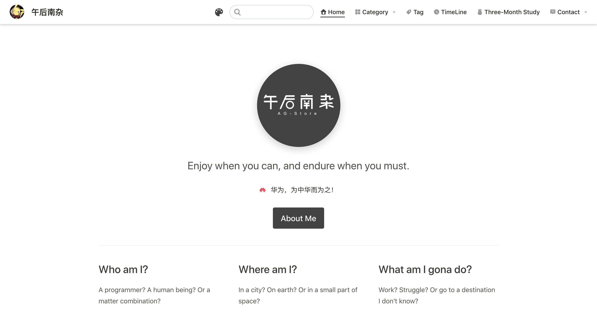
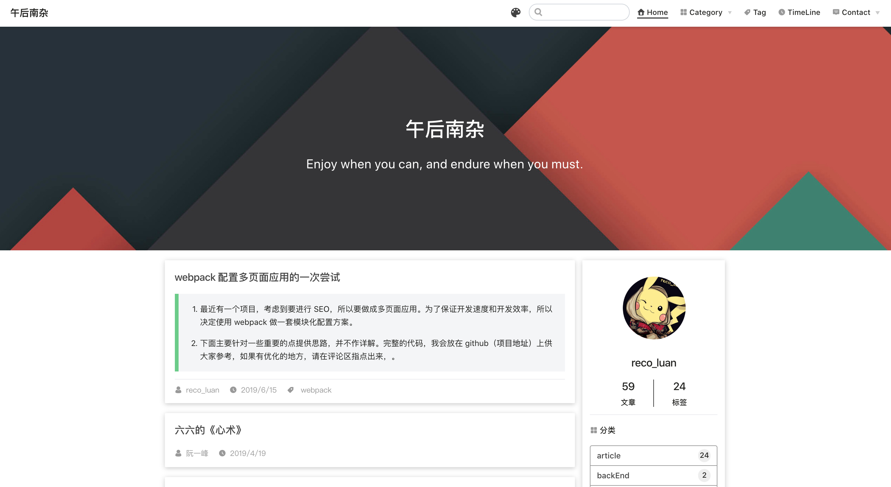
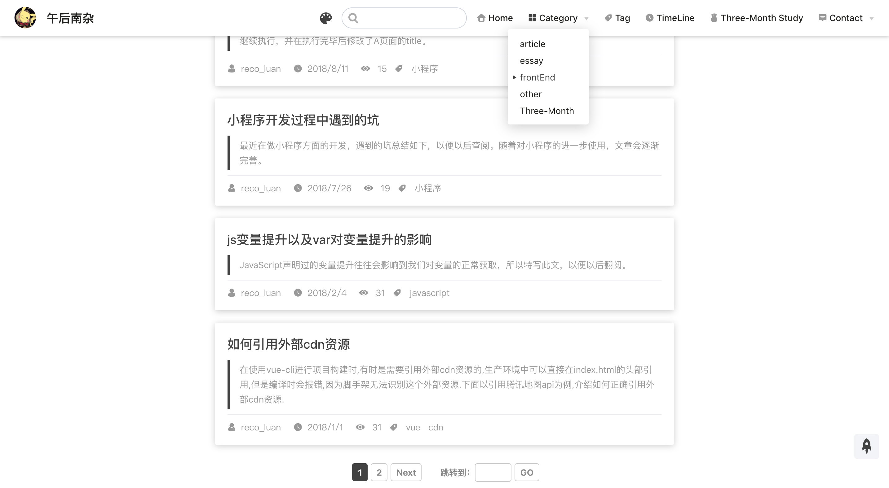
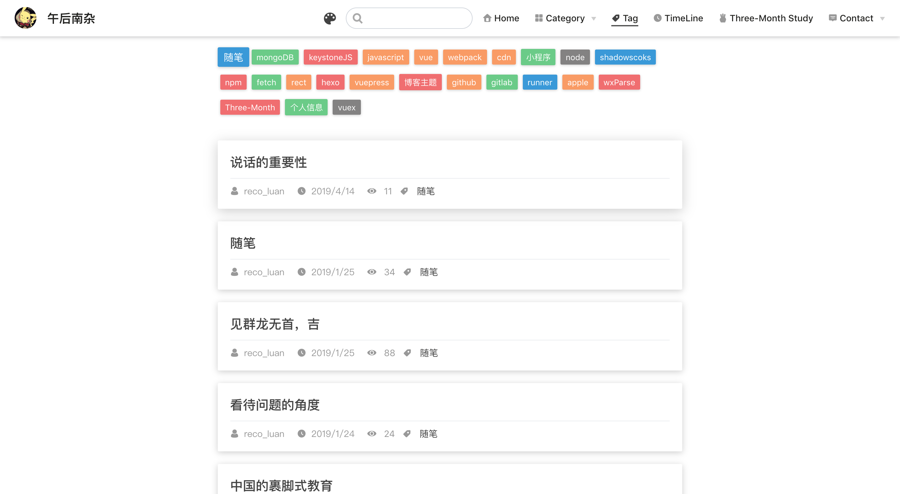
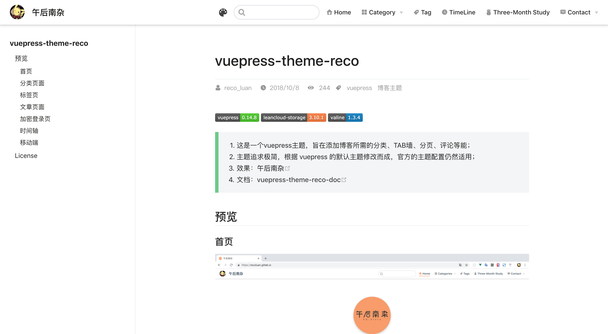
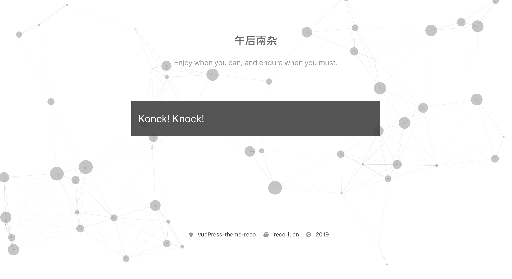
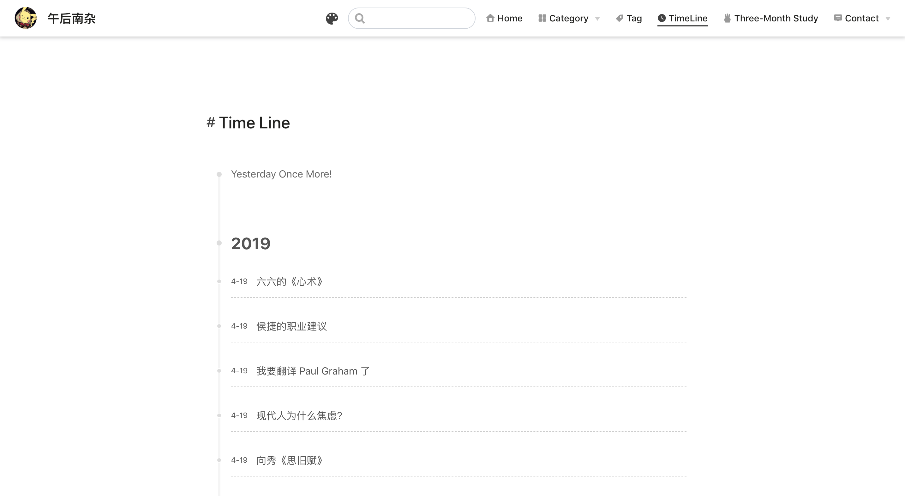

# vuepress-theme-reco

> 1. 这是一个vuepress主题，旨在添加博客所需的分类、TAB墙、分页、评论等能；
> 2. 主题追求极简，根据 vuepress 的默认主题修改而成，官方的主题配置仍然适用；
> 3. 效果：[午后南杂](https://www.recoluan.com) 
> 4. 文档：[vuepress-theme-reco-doc](https://vuepress-theme-reco.recoluan.com)

## 重点提醒

**首页新增 “华为” 相关文案，请允许我以这样的方式支持 “华为”。**

## 预览

### Home

### Home-Blog

### Category

### Tag

### Article

### Add Password

### Timeline

## License
[MIT](https://github.com/recoluan/vuepress-theme-reco/blob/master/LICENSE)
